# Climate Lens — Bangladesh

A 3D geospatial observatory of how Bangladesh's rainfall, heat, and root-zone soil wetness **were**, **are**, and **may become** — district by district, directly grounded in NASA Earth science data and CMIP6 climate model projections.

- Pick a **region** (8 divisions) and a **place** (64 districts). The borders are real, from geoBoundaries.
- Switch between **Past / Now / Future**. The 3D districts rise and fall, and the charts, rankings and labels update with them.
- Press **▶** to play 2001 → 2050 year by year while the camera flies over the region like a drone.
- Base maps and overlays are NASA GIBS imagery: Black Marble night lights, Blue Marble terrain, VIIRS satellite, GPM IMERG rain radar.

---

## Challenge & Approach

> **NASA Space Apps Challenge 2026**  
> **Challenge:** `[CHALLENGE]: Our NASA Space Apps challenge is "<write challenge name here>"` *(TODO: Replace with exact challenge title once finalized)*

### The Problem
Bangladesh is one of the world's most vulnerable frontline nations to accelerating climate volatility. Despite dense meteorological impacts—erratic monsoon shifts, intensified heatwaves, saline intrusion, and flash floods—high-resolution satellite data and climate projections remain locked away in complex NetCDF archives, academic journals, or opaque portals. Sub-national planners, agricultural extension officers, local journalists, students, and citizens lack an accessible, interactive, localized tool to understand past shifts (2001–2010), current conditions, and projected horizons up to 2050 for all 64 districts.

### Target Users
- **Agricultural Extension Officers & Farmers**: Planning sowing and harvesting calendars across Aman, Aus, and Boro seasons against shifts in monsoon onset, soil moisture, and dry spells.
- **Urban & Regional Planners**: Identifying high-vulnerability districts requiring heatwave mitigation, resilient drainage, and water resource protection.
- **Educators, Researchers & Students**: Exploring empirical climate trends, Mann–Kendall statistical significance, and CMIP6 climate scenarios.
- **Journalists & Citizen Advocates**: Communicating climate realities with interactive 3D visualizations, bilingual summaries (English and Bangla), and exportable reports.

### How Climate Lens Responds
1. **Democratizes NASA Earth Data**: Aggregates and serves NASA POWER (`PRECTOTCORR`, `T2M_MAX`, `GWETROOT`), NASA GIBS satellite basemaps, and NASA NEX-GDDP-CMIP6 downscaled climate models in a lightweight, browser-based 3D geospatial environment.
2. **Tri-Temporal Analysis (Past · Now · Future)**: Allows users to slide across a 2001–2010 historical baseline, current near-real-time observations, and mid-century (2040) / 2050 projections with continuous 2001→2050 timeline animation.
3. **Agro-Climatic Intelligence**: Integrates crop calendars and an automated "Unusual Now" anomaly detection engine to surface actionable seasonal risks.
4. **Offline-First & Bilingual**: Engineered as a Progressive Web App (PWA) with full English and Bangla internationalization to bridge the digital and linguistic divide.

---

## Data

| What | Source |
|---|---|
| Rainfall, max temperature, root-zone soil wetness | [NASA POWER](https://power.larc.nasa.gov/) (`PRECTOTCORR`, `T2M_MAX`, `GWETROOT`), monthly 2001–2025 + daily for the last ~400 days (Public Domain) |
| Automated Climate Statistics & Extremes | Generated per district & metric: Sen's slope per decade, Mann–Kendall p-values, 2001–2010 baseline anomalies, percentiles, and extreme indicators (heatwaves, dry spells, heavy rain) (`src/data/analysis/climate-stats.json`, `extremes.json`) |
| Biodiversity Occurrences (Priority Species) | [GBIF Occurrence API](https://api.gbif.org/v1/) (`country=BD`): 1,056 observation records across 6 priority species (Bengal tiger, Ganges dolphin, Irrawaddy dolphin, Hilsa, elephant, fishing cat) with spatial district aggregation and dataset citations (`src/data/analysis/gbif-occurrences.json`). *Note: Reflects observer effort, not population trends.* |
| Natural Hazard Events (Historical & Open) | [NASA EONET v3](https://eonet.gsfc.nasa.gov/api/v3/) (Earth Observatory Natural Event Tracker): open and historical floods, severe storms, wildfires, and landslides inside Bangladesh's bounding box (`src/data/analysis/eonet-events.json`) |
| Crop Yield & Climate Association | [World Bank Open Data](http://api.worldbank.org/v2/country/BGD/indicator/AG.YLD.CREL.KG) (FAOSTAT Cereal Yield) & [BBS Yearbook of Agricultural Statistics](http://bbs.gov.bd/): 24-year national series (Aus, Aman, Boro). Non-parametric Spearman rank correlation with detrended seasonal climate (`src/data/analysis/yield-climate.json`). *Note: National-level analysis; district yields are not fabricated.* |
| Data Pipeline Execution Status | Automated tracking of fetch timestamps, record counts, error logs, and software environment (`src/data/analysis/data-status.json`) |
| CMIP6 Climate Model Projections (2021–2050) | [NASA NEX-GDDP-CMIP6](https://www.nccs.nasa.gov/services/data-collections/land-based-products/nex-gddp-cmip6) (0.25° downscaled multi-model ensemble: GFDL-ESM4, MPI-ESM1-2-HR, MRI-ESM2-0, EC-Earth3, UKESM1-0-LL) |
| Gridded Population & Density (Human Exposure) | [NASA SEDAC GPWv4.11](https://sedac.ciesin.columbia.edu/data/collection/gpw-v4) (Gridded Population of the World, 30-arcsecond resolution, calibrated with BBS 2022 National Census) |
| Vegetation Health Index (NDVI) | [NASA MODIS](https://lpdaac.usgs.gov/products/mod13c2v006/) (`MOD13C2` / `MOD13A2`, 0.05° monthly global vegetation index, tracking Aman/Aus/Boro rice vigor) |
| Division & district borders | [geoBoundaries](https://www.geoboundaries.org/) gbOpen BGD ADM1 / ADM2 (CC BY 4.0) |
| Map imagery | [NASA GIBS](https://earthdata.nasa.gov/gibs) |

- **Past**: The 2001–2010 multi-year average baseline.
- **Now**: The latest 12 complete months (from daily NASA POWER data). The *Last 60 days* chart is fetched live from NASA POWER for the selected district.
- **Future & Timeline Horizons (2040 vs. 2050)**:
  - **Static Future Mode (2040 Horizon)**: In static mode, the Future tab evaluates climate metrics at **2040**—a standard IPCC mid-century adaptation benchmark. This allows immediate, direct comparison against the 2001–2010 baseline.
  - **Continuous Play Animation (2001 → 2050)**: Clicking **▶** animates the entire historical and projected timeline year-by-year from **2001 to 2050**, providing continuous visualization of long-term climate trajectories.
  - **Statistical Trend (Theil–Sen)**: Robust non-parametric regression extending 2001–2025 local NASA POWER trajectories, evaluated at **2040** with a ±95% (±1.96 standard deviation) spread.
  - **CMIP6 SSP2-4.5 (Middle of the Road)**: NASA NEX-GDDP-CMIP6 0.25° downscaled multi-model ensemble capturing moderate mitigation (~2.7°C warming by 2100).
  - **CMIP6 SSP5-8.5 (High Emissions)**: NASA NEX-GDDP-CMIP6 0.25° downscaled multi-model ensemble capturing fossil-fueled unconstrained growth (~4.4°C warming by 2100).
  - **Multi-Model Uncertainty Ribbon**: `YearChart` renders the multi-model median curve alongside a shaded 10th-to-90th percentile ensemble spread band, displayed directly adjacent to the statistical trend line for instant scientific comparison.
  - **Scenario Selector**: Switch scenarios seamlessly in Future mode and on the chart header; full state persists in URL query parameters (`?scenario=ssp245`).
- **Anomaly Mode**: Click **Anomaly** to toggle district deviations relative to the 2001–2010 baseline. Uses diverging color palettes (blue ↔ red for temperature; brown ↔ green for rainfall and soil wetness) across the 3D map, ranked district list, and DetailPanel.
- **Extreme-Event Indicators**: Tracks heatwave days (max temperature ≥ 36°C, configurable in `constants.ts`), longest dry spell (consecutive days < 1 mm rain), and heavy rain days (precipitation ≥ 50 mm/day).
- **Climate Stripes & Heatmaps**: Visualizes long-term warming/drying stripes (2001–2025) and a 25-year × 12-month monthly matrix heatmap in both absolute and baseline anomaly views.
- **Statistical Significance**: YearChart computes the **Theil–Sen slope per decade** along with non-parametric **Mann–Kendall p-values** to label significant climate trends ($p < 0.05$).
- **Compare Mode**: Select two districts to inspect them side by side. Displays comparative hero metrics, split Past/Now/Future values, and overlaid two-color graphs on both `YearChart` (historical & projections) and `SeasonChart` (12-month annual cycle), with dual highlights on the 3D map.
- **URL Synchronization & Link Sharing**: Automatically mirrors application state (`division`, `district`, `compare`, `metric`, `time`, `year`, `anomaly`, `scenario`) to URL query parameters (`?dist=dhaka&comp=sylhet&m=heat&t=future&scenario=ssp245`), allowing any view to be copied, shared, and bookmarked. Full state is restored on page load.
- **Export & Reporting Options**:
  - **Chart PNG**: Export high-resolution chart images directly from the toolbar or individual chart headers.
  - **Data CSV**: Download complete 2001–2050 historical and projected district time-series along with the 12-month seasonal climatology.
  - **Summary Report PDF**: Generate a clean, publication-ready, one-page A4 PDF summary report containing baseline comparisons, decadal trends, Mann–Kendall significance, seasonal cycles, recent extreme events, and methodology notes.
- **Bilingual Support (English & Bangla)**:
  - Full internationalization (`i18n`) system with instant language switcher (`EN` / `বাং`) in the header and persistent `localStorage` selection.
  - All UI strings, all 8 divisions, and all 64 districts translated into native Bangla while keeping canonical geoBoundaries IDs unchanged.
  - Native Bengali numerals (`০-৯`) used throughout numbers, dates, coordinates, and chart metrics when Bangla is active.
  - Automated plain-language summaries generated in both English and Bangla.
  - Web font integration with Google Fonts `Noto Sans Bengali` alongside `Inter`, optimized with responsive typographic scale and line-heights.
- **Agriculture Mode & Crop Calendars (Phase 5)**:
  - Dedicated **Agriculture** tab in the DetailPanel featuring seasonal crop calendars for Bangladesh's three staple rice seasons:
    - **Aman Rice (আমন ধান)**: Sowing & nursery: Jun–Jul; transplanting: Jul–Aug; flowering & grain-filling: Sep–Oct; harvest: Nov–Dec (Monsoon / Rainfed, months 5–10). Sensitive to monsoon drought, late rain cessation, and vegetative flash floods.
    - **Aus Rice (আউশ ধান)**: Sowing: Apr–May; vegetative growth: May–Jun; flowering & panicle: Jun; harvest: Jul (Pre-monsoon / Early summer, months 3–6). Sensitive to pre-monsoon moisture deficits, early flash flooding in haors, and flowering heat stress ($T_{\text{max}} \ge 36^\circ\text{C}$).
    - **Boro Rice (বোরো ধান)**: Seedbed: Nov–Dec; transplanting: Dec–Jan; tillering: Feb–Mar; flowering & harvest: Apr–May (Dry winter / Irrigated, months 11, 0–4). Highly dependent on shallow/deep aquifer irrigation; vulnerable to groundwater depletion, dry winter spells, and April reproductive heatwaves (spikelet sterility).
  - **Crop Calendar Sources & Citations**:
    1. **Bangladesh Rice Research Institute (BRRI)**: *Adhunik Dhaner Chash (Modern Rice Cultivation)*, 23rd Ed., Gazipur, Bangladesh. Provides standardized phenological calendars across 30 Agro-Ecological Zones (AEZs).
    2. **Department of Agricultural Extension (DAE)**: *Krishi Projukti Hatboi (Handbook on Agricultural Technology)*, Ministry of Agriculture, Government of Bangladesh. Standard crop calendar for Aus, Aman, and Boro cropping sequences.
    3. **Food and Agriculture Organization (FAO)**: *FAO/GIEWS Country Brief — Bangladesh: Crop Calendar and Reference Phenology*. United Nations Food and Agriculture Organization.
  - **Growing-Season Multi-Metric Comparison**:
    - For any selected district, filters NASA satellite and land-surface data down to the exact active calendar months of each crop.
    - Compares **Total Growing-Season Rainfall** ($\text{mm}$), **Mean Daily Maximum Temperature** ($^\circ\text{C}$), and **Root-Zone Soil Wetness** ($\%$) across the 2001–2010 historical baseline, current observed ("Now") window, and 2040 projected trajectory.
  - **Transparent Decision Rules & Risk Labels (No Black Boxes)**:
    - Assigns an actionable **Low / Medium / High Risk** (কম / মাঝারি / উচ্চ ঝুঁকি) classification to each crop.
    - **Zero Black Boxes**: Every crop card displays the exact underlying rule logic and threshold formula side-by-side with the district's specific numbers:
      - *Aman*: High Risk if monsoon rain deficit $\le -20\%$ or root-zone wetness depletion $\le -4.0\%$. Medium Risk if deficit $\le -8\%$, excess rain $\ge +30\%$ (flood risk), or warming $\ge +1.0^\circ\text{C}$.
      - *Aus*: High Risk if pre-monsoon rain deficit $\le -22\%$, soil wetness $\le -5.0\%$, or heat stress $T_{\text{max}} \ge 36.0^\circ\text{C}$. Medium Risk if deficit $\le -10\%$ or excess flood rains $\ge +35\%$.
      - *Boro*: High Risk if root-zone moisture depletion $\le -5.0\%$, winter rain deficit $\le -35\%$, or flowering heat stress $T_{\text{max}} \ge 36.0^\circ\text{C}$ (spikelet sterility). Medium Risk if moisture depletion $\le -2.0\%$ or warming $\ge +1.0^\circ\text{C}$.
  - **Auto-Generated District Story Card**:
    - Synthesizes 3 distinct, plain-language sentences contextualizing each district:
      1. *What changed in 20+ years*: Observed 2001–2025 decadal shift in mean temperature and annual precipitation patterns.
      2. *What is expected by 2040*: Projected trajectory combining empirical Theil–Sen trends and CMIP6 climate model projections.
      3. *Who is most affected*: Tailored community vulnerability profiles across Bangladesh's distinct eco-geographical zones:
         - **Coastal saline zone** (e.g. Satkhira, Barguna, Patuakhali): Salinity intrusion, tidal inundation, and cyclone surges affecting coastal paddy farmers and artisanal fisherfolk.
         - **Barind tract / drought-prone northwest** (e.g. Rajshahi, Chapai Nawabganj, Naogaon): Severe groundwater depletion and intense pre-monsoon heat stress impacting irrigated Boro growers.
         - **Haor wetland basin** (e.g. Sunamganj, Sylhet, Netrokona): Premature flash floods and extended submergence destroying single-crop Boro harvests.
         - **Chittagong Hill Tracts** (e.g. Bandarban, Rangamati): Slope landslides and flash torrents threatening indigenous terrace and jhum farmers.
         - **Central floodplain & urban zones** (e.g. Dhaka): Urban heat island extremes, riverbank erosion, and outdoor laborer vulnerability.
  - **Indicative Decision Support Disclaimer**:
    - Prominently labeled across the interface as *Indicative Decision Support — Not an official meteorological or agricultural forecast* (refer to DAE / BMD for official advisories).
  - **"Unusual now" 60-Day Rolling Alert Badge**:
    - Evaluates whether the last 30–60 days deviate significantly from the district's historical normal range ($|z| \ge 1.5$ or outside 10th–90th percentiles for precipitation, temperature, or soil wetness) with quick navigation to agricultural diagnostics.
- **NASA SEDAC Gridded Population & Climate Exposure Impact (Phase 3)**:
  - Integrates **NASA SEDAC Gridded Population of the World (GPWv4.11)** (CIESIN/Columbia University) at 30-arcsecond resolution (~1 km), cross-calibrated with the official 2022 Bangladesh Bureau of Statistics (BBS) Census.
  - **Exposed Population Formula (Scientific Integrity)**:
    $$\text{Exposed Population} = \sum_{d \in \mathcal{D}_{\text{trend}}} \text{Pop}(d)$$
    where $\mathcal{D}_{\text{trend}}$ contains all districts where the non-parametric Mann–Kendall test confirms a statistically significant trend ($p < 0.05$):
    - *Significant Warming*: Maximum temperature ($T_{\text{max}}$) Sen's slope $> 0$ with $p < 0.05$.
    - *Significant Drying*: Precipitation or root-zone soil wetness Sen's slope $< 0$ with $p < 0.05$.
    - *Monsoon Intensification / Wetting Surge*: Precipitation or root-zone soil wetness Sen's slope $> 0$ with $p < 0.05$ (the dominant historical signal in Bangladesh, exposing 63 out of 64 districts — 162.3 Million people, 98.4% of the population — to heightened flood, waterlogging, and flash flood hazards).
  - Displays transparent breakdown metrics, district-level exposure pills, and complete mathematical explanations in both English and Bangla.
- **NASA MODIS NDVI Vegetation Health & Agricultural Monitoring (Phase 3)**:
  - Integrates **NASA MODIS Terra/Aqua (`MOD13C2` / `MOD13A2`)** monthly 0.05° global vegetation index records across 2001–2025.
  - Computes a 2001–2010 baseline seasonal cycle (12 calendar months), current 12-month greenness, canopy anomalies, and a **Vegetation Vigor Index** (% of baseline) classified into *Robust*, *Normal*, *Moderate Stress*, and *Severe Drought Stress*.
  - Compares vegetative development across the three primary rice seasons: Boro (Dec–Apr), Aus (Apr–Aug), and Aman (Jul–Nov).
  - Detects agricultural drought and moisture deficits in crops weeks before visible physical browning.

---

## Limitations & Scientific Notes

Climate Lens adheres to strict scientific communication standards. Below are the key physical, statistical, and operational limitations of the system:

1. **NASA POWER Spatial Resolution (~0.5° / ~50 km Grid)**:
   - NASA POWER surface meteorological data is synthesized on a global ~0.5° × 0.5° latitude/longitude grid (~55 km × 55 km at Bangladesh latitudes).
   - District values are extracted from the grid cell containing each district polygon centroid.
   - Consequently, smaller neighboring districts (e.g., Dhaka, Narayanganj, and Gazipur) that fall within or intersect the same 0.5° grid box exhibit identical or near-identical raw meteorological values.
   - Microclimatic differences (such as urban heat islands vs. adjacent rural riverbanks, or steep elevation gradients in the Chittagong Hill Tracts) are averaged across the 50 km cell and cannot be resolved at the single-farm scale.
   - For sub-regional modeling, CMIP6 NEX-GDDP projections are provided at 0.25° (~27 km) resolution.

2. **GBIF Observer & Sampling Bias**:
   - Occurrence records from the Global Biodiversity Information Facility (GBIF) reflect **human sampling effort and geographic accessibility**, NOT true biological population size or geographical distribution.
   - Sightings cluster disproportionately along roads, eco-reserves, university campuses, and tourist destinations (e.g. Lawachara National Park, Sundarbans launch routes).
   - An increase in yearly record counts over time reflects expanding smartphone adoption, citizen science platforms (eBird, iNaturalist), and digitization projects, rather than a genuine recovery of endangered wildlife populations.

3. **Small-Sample Correlations ($n = 24$ Years)**:
   - The World Bank / FAOSTAT national cereal yield dataset spans 24 annual records (2000–2023).
   - While evaluated using non-parametric Spearman rank correlation ($\rho$) against detrended climate variables, **correlation does NOT prove causation**.
   - Over the last three decades, national rice output in Bangladesh has quadrupled primarily due to agronomic and socio-economic drivers: rapid adoption of High-Yielding Varieties (HYV, e.g. BRRI dhan28/29), expansion of motorized shallow-tubewell irrigation, fertilizer subsidies, and improved pest management. These technological inputs can mask or exaggerate underlying climate stress signals.
   - District-level agricultural yield statistics are not published via public APIs by BBS; hence, national data is used without fabricating artificial district-level yields.

4. **Temporary Unavailability & Latency of Live Feeds**:
   - Live NASA POWER, NASA EONET v3, and GBIF endpoints are queried on-demand from the client's browser.
   - These external public APIs may experience periodic maintenance downtime, latency spikes, rate-limiting, or CORS network policies.
   - Climate Lens is engineered with full resilience: all queries feature automatic exponential backoff retries, local IndexedDB caching (with 1–6 hour TTLs), and an immediate graceful fallback to pre-compiled static analysis snapshots (`src/data/analysis/`). The real-time connection status is displayed transparently in the app footer.

5. **Future Projections — Statistical Trend vs. Physical GCMs**:
   - In static Future mode, the default display is an **empirical statistical trend** computed using Theil–Sen robust linear regression across 2001–2025 observations, evaluated at 2040 with a ±95% confidence interval.
   - When **SSP2-4.5** or **SSP5-8.5** is selected, the application switches to **physics-based General Circulation Models (GCMs)** from NASA NEX-GDDP-CMIP6. While statistical trends assume recent trends continue linearly, CMIP6 models incorporate greenhouse gas emissions, radiative forcing, atmospheric dynamics, and monsoon monsoon interactions.
   - The shaded ribbon represents the 10th to 90th percentile multi-model ensemble spread across 5 vetted GCMs (GFDL-ESM4, MPI-ESM1-2-HR, MRI-ESM2-0, EC-Earth3, UKESM1-0-LL).

6. **2001 Baseline Start Year Justification**:
   - The dataset starts in 2001 because NASA POWER underwent a major methodological and satellite assimilation transition around 2000–2001 (notably the integration of the Tropical Rainfall Measuring Mission / TRMM and modern MODIS radiance products).
   - Extending backward into the 1980s or 1990s introduces artificial statistical step-changes in precipitation and soil moisture caused by sensor shifts rather than genuine climate change. Starting at 2001 guarantees a homogeneous, scientifically valid satellite record.

7. **Extreme Event Thresholds**:
   - Heatwave days are calculated from daily maximum temperatures ($T_{\text{max}} \ge 36^\circ\text{C}$), corresponding to the Bangladesh Meteorological Department (BMD) definition for mild heatwaves (36.0–37.9°C), with moderate (38.0–39.9°C) and severe ($\ge 40.0^\circ\text{C}$) thresholds.
   - Heavy rainfall days are defined as precipitation $\ge 50\text{ mm/day}$ following BMD and IMD standards.
   - Consecutive dry days track periods with $< 1\text{ mm/day}$ precipitation.

8. **Indicative Agro-Climatic Advisory**:
   - Risk classifications (Low / Medium / High) and the "Unusual Now" alert badge are designed for educational, research, and planning awareness. They do not replace official emergency forecasts or warnings issued by the Bangladesh Meteorological Department (BMD) or the Department of Agricultural Extension (DAE).

---

## Climate Impacts: Evidence & Limits

To prevent speculative climate claims and maintain strict scientific integrity, Climate Lens incorporates a curated **Climate Impact Knowledge Base** (`src/data/impacts.json`) alongside the **Wildlife & Extinction Gallery** (`src/data/wildlife.json`). Every entry links real-world observations directly to verified literature (complete bibliography in [docs/sources.md](file:///d:/projects/nasa%202/nasa.zip/docs/sources.md)).

### 1. How Entries Were Selected
- **Verified Sources Only**: Every entry must cite a peer-reviewed scientific journal article (PLOS, Elsevier, Springer, Taylor & Francis) or an official government/institutional assessment (BRRI, BARI, BFRI, Department of Fisheries, Bangladesh Forest Department SUFAL, IUCN Bangladesh).
- **Mandatory DOI or Institutional URL**: All entries require an active, traceable URL or DOI checked and recorded with a timestamp. Anonymous estimates, blog posts, and unverified secondary claims are strictly prohibited.
- **Geographic Relevance**: Studies must either be conducted within Bangladesh or directly evaluate transboundary river basins and ecosystems impacting Bangladesh.

### 2. Evidence Taxonomy & Causality Labels
To distinguish between measured ground realities and simulated scenarios, entries are classified by evidence type and causality link:

- **Evidence Types**:
  - `observed_data`: Direct field measurements, weather station records, and empirical surveys (e.g. BMD station trends, Department of Fisheries migration bottlenecks).
  - `statistical_study`: Econometric or multi-variable regression models isolating climatic influences from non-climatic factors (e.g. Mamun et al. 2025).
  - `model_projection`: Predictive bioclimatic simulation models based on future IPCC emission scenarios (e.g. Mukul et al. 2019 MaxEnt tiger habitat projections).
  - `review`: Comprehensive systematic literature reviews synthesising multi-year trials (e.g. Nature-Based Solutions 2025).
  - `news_or_expert_estimate`: Institutional reports and on-the-record field estimates from qualified agronomists/biologists during acute events (e.g. 2024 heatwave yield losses).
  - `farmer_perception`: Structured field interviews and grower surveys reflecting lived agricultural realities.

- **Climate Causality Links**:
  - `direct`: Climate variable is the established primary physical driver (e.g. heat-induced rice spikelet sterility at $T_{\text{max}} \ge 36^\circ\text{C}$).
  - `contributing`: Climate is one of several intersecting drivers alongside human extraction, siltation, or habitat fragmentation (e.g. Hilsa migration barriers, river dolphin mortality).
  - `unclear`: Empirical correlation observed, but underlying mechanism is disputed or insufficiently isolated.
  - `not_established`: Factor is investigated, but historical evidence does NOT attribute the phenomenon to climate change (e.g. Bangladesh's 31 regionally extinct species).

### 3. Why Correlation is NOT Causation Here
In Bangladesh's dynamic agricultural landscape, a statistical correlation between climate anomalies and crop yields or species presence does **not** prove isolated climate causation:
- **Agronomic Confounders**: National rice production has quadrupled since 1971 despite rising temperatures, driven by rapid adoption of High-Yielding Varieties (HYVs like BRRI dhan28/29), extensive groundwater irrigation, and chemical fertilizer subsidies. Confounding variables frequently mask or exaggerate climate signals.
- **Hydrological Interventions**: Upstream transboundary water diversion (e.g. Farakka Barrage) significantly dictates dry-season river discharge and salinity intrusion in the southwest, independent of local rainfall trends.
- **Human Exploitation**: Fisheries decline is heavily influenced by illegal monofilament gillnets (*current jal*), mechanized marine trawling, and estuarine pollution. Similarly, historic wildlife extinctions were driven by colonial and post-colonial hunting, forest clearing, and agricultural drainage.
- *Notice in App*: All impact cards carry a prominent disclaimer: *"These are documented impacts from published sources, shown for context. They are not localized forecasts for every farm."*

### 4. Which Studies Disagree (Mixed Consensus)
Where scientific literature diverges, Climate Lens labels consensus as `mixed` and presents contrasting viewpoints:
- **Aus Rice Response**: Mamun et al. (2025) found that mild temperature increases and regular pre-monsoon precipitation in northeastern districts (Sylhet) positively correlated with Aus yields. Conversely, national BMD station regressions (Mainuddin et al. 2022) demonstrate that when maximum temperatures exceed $36^\circ\text{C}$ during the reproductive panicle initiation window, severe spikelet sterility occurs, turning warming into a net negative.
- **Boro Winter Temperature**: Econometric studies in northwest Bangladesh (Springer 2022) indicate that higher winter minimum temperatures can sometimes buffer young Boro seedlings against cold injury, whereas agro-hydrological reviews (Elsevier 2025) show that accompanying soil moisture stress causes up to a 32% yield crash.
- **Sundarbans & Mangrove Mortality**: While sea level rise and saline intrusion contribute to mangrove stress, extensive forestry literature emphasizes that *Heritiera fomes* (Sundari) top-dying disease is heavily mediated by fungal pathogens (*Ceratocystis*) and reduced freshwater flushing from upstream rivers.

### 5. What is NOT Covered (Honest Disclosure of Gaps)
- **Fruits without Peer-Reviewed Studies**: Widely reported domestic fruits such as **jackfruit** (*Artocarpus heterophyllus*), **guava** (*Psidium guajava*), and **watermelon** (*Citrullus lanatus*) frequently suffer blossom drop and premature rot during abnormal spring heatwaves. However, rigorous peer-reviewed microclimate response curves for these crops in Bangladesh do not yet exist. In adherence to scientific integrity rules, they were excluded from `impacts.json` until verified literature is published.
- **Microclimate Damping**: Grid-scale 0.5° satellite observations cannot capture micro-scale cooling from riverbanks, farm agro-forestry, or shading canopies.
- **Deterministic Predictions**: The Knowledge Base documents empirical findings and published scenarios; it does not provide predictive guarantees for individual plots.

---

## Technical Quality & Architecture

- **Full TypeScript Migration**: The entire application (`src/lib`, `src/hooks`, `src/components`, `src/workers`) is strictly typed with TypeScript, delivering complete type-safety across GeoJSON geometry, climate datasets, and CMIP6 structures.
- **Progressive Web App (PWA) & Offline Mode**: Configured with Web App Manifest (`manifest.webmanifest`), adaptive icons (`icon.svg`), and custom Service Worker (`sw.js`). Employs Stale-While-Revalidate and Cache-First strategies to enable instant offline exploration of all 64 districts and NASA projections without network access.
- **Automated Monthly Ingestion Action**: GitHub Action workflow (`.github/workflows/data-update.yml`) runs on the 1st of every month to ingest the latest NASA POWER observations, execute automated data validation and physical outlier checks (`scripts/validate-data.mjs`), and open a pull request when updates are detected.
- **Web Worker Statistical Offloading**: Intensive mathematical operations (Mann–Kendall trend tests, Theil–Sen decadal slope regressions) can be dispatched to dedicated background Web Workers (`src/workers/metrics.worker.ts`) with transparent main-thread fallback, keeping the 3D MapLibre canvas silky smooth.
- **Empirical Back-Testing & Statistical Validation**: Includes an automated validation pipeline (`scripts/backtest.mjs`) that trains the Theil–Sen regression model strictly on 2001–2015 observations and tests predictions against real NASA POWER observations for 2016–2025 across all 64 districts. Computes MAE, RMSE, and empirical 95% prediction interval coverage saved to `src/data/validation.json`.
- **In-App "Methods & Validation" Observatory**: On-demand scientific validation modal (`ValidationModal.tsx`, accessible via the `🔬` button in the header or DetailPanel) featuring national KPI summary cards, an interactive Predicted vs. Observed test chart (2016–2025), a division-by-division performance table, and explicit documentation of scientific limitations.
- **Interactive About / Help Guide**: Onboarding modal (`AboutModal.tsx`) introduces first-time visitors to the 3D map navigation, Past/Now/Future modes, and NASA data sources, accessible anytime via the `?` button in the header.

---

## Automated Data Pipeline, Reliability & How to Contribute

Climate Lens features a reproducible, automated data pipeline engineered to pull real scientific data from verified open APIs, compute non-parametric statistics, validate data integrity, and ship compact artifacts to the client application.

### 1. Hard Engineering Rules

1. **Zero Fabricated or Hallucinated Data**: No placeholder or simulated numbers are permitted in production datasets. Every number reflects real scientific observations or vetted climate projections.
2. **Mandatory Provenance Metadata**: Every JSON output in `src/data/analysis/` must contain full provenance: source name, source URL, fetch timestamp, query parameters, record counts, and license/attribution text.
3. **Resilient Failure Handling**: If an upstream API request fails or times out, the pipeline retains the last known good cached JSON, logs the failure with error telemetry in `src/data/analysis/data-status.json`, and exits with a non-zero status code if critical data cannot be verified.
4. **No Secrets in Bundles**: All integrated sources are open, public-domain, and keyless. No secret tokens, credentials, or private keys are ever committed to the repository or exposed in the client bundle.
5. **Heavy Compute Stays in Scripts / Web Workers**: Intensive mathematical operations (Sen's slope per decade, Mann–Kendall rank tests, 25-year seasonal normalizations) are executed during pipeline generation or in background Web Workers (`src/workers/metrics.worker.ts`), keeping the browser UI 60fps.

---

### 2. How to Run the Pipeline Locally

```bash
# 1. Fetch latest observations and build all analysis datasets
npm run data

# 2. Validate all JSON datasets for schema, provenance, and physical bounds
npm run validate:data

# 3. Validate that every impact knowledge-base entry cites a peer-reviewed source
npm run validate:impacts

# 4. Run TypeScript typechecking across the entire codebase
npm run typecheck

# 5. Run the complete Vitest test suite
npm test
```

---

### 3. How Data Flows

```mermaid
flowchart TD
    subgraph Upstream ["1. Upstream Open APIs"]
        NASA_POWER["NASA POWER API\n(Daily & Monthly Meteorology)"]
        GBIF["GBIF Occurrence API\n(Priority Species Observations)"]
        EONET["NASA EONET v3\n(Natural Hazard Events)"]
        WB["World Bank / FAOSTAT\n(National Cereal Yields)"]
    end

    subgraph Pipeline ["2. Automated Ingestion & Statistics (scripts/build-data.mjs)"]
        Ingest["HTTP Fetcher with Exponential Backoff\n& Local Disk Cache"]
        StatsEngine["Statistical Computation Engine\n• Theil–Sen decadal slope\n• Mann–Kendall p-value\n• 2001–2010 baseline anomalies\n• Extremes & SPEI dry spells"]
    end

    subgraph Artifacts ["3. Analysis JSON Artifacts (src/data/analysis/)"]
        CS["climate-stats.json\n(64 districts × 4 metrics)"]
        EXT["extremes.json\n(Heatwave, dry spells, heavy rain)"]
        GB["gbif-occurrences.json\n(1,056 species records)"]
        EO["eonet-events.json\n(Floods, cyclones, storms)"]
        YC["yield-climate.json\n(Spearman yield correlations)"]
        DS["data-status.json\n(Telemetry, timestamps, errors)"]
    end

    subgraph Gatekeeper ["4. Quality & Sanity Validation (scripts/validate-data.mjs)"]
        Validator["Data Validator\n• Provenance schema check\n• Physical bounds check (-5°C to 55°C, rain >= 0)\n• 64 districts completeness check\n• Zero NaN / undefined check"]
    end

    subgraph Runtime ["5. Client Browser Runtime & Workers"]
        Worker["Web Worker (metrics.worker.ts)\n& IndexedDB Cache (apiCache.ts)"]
        UI["React 19 & MapLibre GL 3D Canvas\n• 3D extruded choropleths\n• DistrictInsightsPanel\n• SpeciesRecordsModal & HazardFeed\n• SystemStatusBar footer"]
    end

    Upstream --> Ingest
    Ingest --> StatsEngine
    StatsEngine --> Artifacts
    Artifacts --> Gatekeeper
    Gatekeeper -->|Passes CI Gate| Runtime
```



1. **Extraction**: `scripts/build-data.mjs` queries NASA POWER, GBIF, NASA EONET v3, and World Bank Open Data with automated rate-limiting and retry backoff.
2. **Analysis**: Computes decadal slopes, Mann–Kendall rank correlation $S$, variance $V(S)$, $Z$-scores, and two-tailed $p$-values per district and metric.
3. **Artifact Generation**: Emits compact, structured JSON files into `src/data/analysis/` containing complete provenance stamps.
4. **Validation Gate**: `scripts/validate-data.mjs` verifies that every file adheres to the provenance schema and that all values lie within physically sane ranges (e.g. $T_{\text{max}} \in [-5, 55]^\circ\text{C}$, Rain $\ge 0\text{ mm}$, $p \in [0, 1]$).
5. **Client Presentation**: React components consume the pre-computed analysis snapshots for instant loading, while live Web Workers compute user-customized date ranges in the background.

---

### 4. How to Add a New Data Source

Follow these steps to integrate a new environmental, agricultural, or meteorological source:

#### Step 1: Verify Upstream Documentation
- Confirm the official API endpoint, query parameters, update frequency, and license.
- The source **must be public and keyless** (no private API tokens permitted).
- Check CORS support if the source will be queried directly in the browser.

#### Step 2: Implement Ingestion Logic in `scripts/build-data.mjs`
- Create a dedicated fetch routine using `fetchWithRetry()` or Node.js native `fetch`.
- Implement local caching in `scripts/cache/` to ensure offline reproducibility during development.
- Record failure telemetry in `data-status.json` if the request fails; never overwrite existing datasets with empty data.

#### Step 3: Include Required Provenance Metadata
Every generated JSON must follow the standard envelope schema:
```json
{
  "source": "Official Agency Name",
  "sourceUrl": "https://api.agency.gov/endpoint",
  "fetchedAt": "2026-10-02T16:34:00.000Z",
  "license": "Public Domain / CC BY 4.0",
  "parameters": { ... },
  "recordCount": 1234,
  "data": { ... }
}
```

#### Step 4: Add Validation Rules to `scripts/validate-data.mjs`
Add a validator function checking:
- Presence of required provenance keys (`source`, `sourceUrl`, `license`, `fetchedAt`, `recordCount`).
- Non-empty records array or district dictionary.
- Strict physical sanity bounds (no `NaN`, `null`, or out-of-bounds numeric anomalies).

#### Step 5: Declare TypeScript Types & Mount UI Components
- Define strict TypeScript interfaces in `src/lib/types.ts`.
- Create or update presentation components (e.g., in `src/components/`).
- Add localized English and Bangla strings to `src/lib/i18n/en.ts` and `src/lib/i18n/bn.ts`.
- Document the new source in `docs/sources.md` with the date checked and verification notes.

---

### 5. GitHub Actions Automated Pipeline & CI/CD

Climate Lens includes a robust GitHub Actions workflow ([`.github/workflows/data-update.yml`](file:///d:/projects/nasa%202/nasa.zip/.github/workflows/data-update.yml)) that automates data updates:

- **Schedule**: Executes on the 1st of every month at 03:00 UTC (`0 3 1 * *`) and on manual trigger (`workflow_dispatch`).
- **Steps**:
  1. Checks out repository and sets up Node.js LTS environment.
  2. Runs `npm run data` to ingest fresh NASA POWER, GBIF, and EONET data.
  3. Executes `npm run validate:data` and `npm run validate:impacts` (fails loudly with exit code 1 if any value is out-of-range or schema is invalid).
  4. Runs `npm test` and `npm run typecheck` to prevent regressions.
  5. Inspects `git status --porcelain src/data/`. If data changed, opens an automated Pull Request via `peter-evans/create-pull-request@v6` with complete update summaries.
  6. **Security**: Uses default `GITHUB_TOKEN` permissions; never pushes secrets or pushes directly to main.

---

## Deployment (Vercel & Netlify)

Climate Lens is optimized for zero-configuration deployment to standard static hosting platforms and edge CDNs:

### Vercel
1. Connect your GitHub repository to Vercel.
2. The repository includes [vercel.json](file:///d:/projects/nasa%202/nasa.zip/vercel.json) with single-page application (SPA) rewrite rules to `/index.html`.
3. Build Settings:
   - **Framework Preset**: Vite
   - **Build Command**: `npm run build`
   - **Output Directory**: `dist`

### Netlify
1. Connect your GitHub repository to Netlify.
2. The repository includes [public/_redirects](file:///d:/projects/nasa%202/nasa.zip/public/_redirects) (`/* /index.html 200`) ensuring all deep links (`?dist=dhaka&m=heat`) resolve smoothly on direct refresh.
3. Build Settings:
   - **Build Command**: `npm run build`
   - **Publish Directory**: `dist`

### Base Path Note
In [vite.config.js](file:///d:/projects/nasa%202/nasa.zip/vite.config.js), `base` defaults to `/`, which works out-of-the-box for custom domains, Vercel (`*.vercel.app`), and Netlify (`*.netlify.app`).

---

## Run & Test

```bash
npm install
npm run dev             # Start Vite dev server (http://localhost:5173)
npm run typecheck       # Verify TypeScript type correctness (tsc --noEmit)
npm run test            # Run Vitest unit test suite (54+ tests)
npm run lint            # Run ESLint checks
npm run format:check    # Check code style with Prettier
npm run build           # Build optimized production PWA bundle
npm run backtest        # Run 2001–2015 train -> 2016–2025 test back-testing
npm run data            # Fetch latest NASA POWER + borders → src/data/
npm run validate:data   # Run dataset integrity and physical outlier validator
```

---

## License

This project is licensed under the MIT License - see the [LICENSE](file:///d:/projects/nasa%202/nasa.zip/LICENSE) file for details.

---

## Structure

```
scripts/
├── build-data.mjs            fetches NASA POWER + geoBoundaries → src/data/*.json
├── build-cmip6.mjs           preprocesses NASA NEX-GDDP-CMIP6 downscaled ensemble → src/data/cmip6.json
├── backtest.mjs              trains 2001–15 & tests 2016–25 back-testing → src/data/validation.json
└── validate-data.mjs         validates district counts, array integrity, and physical outlier bounds
public/
├── manifest.webmanifest      PWA web application manifest
├── sw.js                     offline caching Service Worker
├── icon.svg                  vector lens application icon
├── _redirects                Netlify SPA routing rules
└── ...
src/
├── App.tsx                   app state, URL sync, compare mode orchestration, help & validation modals
├── lib/
│   ├── types.ts              canonical TypeScript interfaces & union types
│   ├── metrics.ts            Past / Now / Future values, CMIP6 & Theil–Sen projection, Mann–Kendall, seasonal cycles
│   ├── constants.ts          metrics, thresholds, scenarios (SSP2-4.5/5-8.5), time colours, ramps
│   ├── export.ts             client-side PNG, CSV, and jsPDF 1-page report generators
│   ├── urlState.ts           query parameter parser, serializer, and history syncer
│   ├── agriculture.ts        crop calendars (Aman/Aus/Boro), agro-climate risk, and 60-day unusual alert
│   ├── workerMetrics.ts      Web Worker wrapper for async statistical processing with fallback
│   ├── i18n/                 i18n Context provider, en/bn dictionaries, automated summary engine
│   └── format.ts             number, anomaly, date and Bangla numeral formatters
├── components/
│   ├── map/                  ClimateMap (MapLibre 3D + drone flight), mapStyle (NASA GIBS), animator, MapNav
│   ├── charts/               YearChart (CMIP6 ribbon + trend compare), SeasonChart, DailyChart, StripesChart, HeatmapChart
│   ├── AgriculturePanel.tsx  interactive crop calendar timeline, risk cards, and 60-day anomaly chips
│   ├── AboutModal.tsx        onboarding and guide modal for first-time visitors (? button in header)
│   ├── ValidationModal.tsx   Methods & Backtest Validation observatory with interactive chart & division table
│   ├── DivisionPicker.tsx    mini-map region tiles
│   ├── DistrictList.tsx      ranked districts with quick compare badges
│   ├── DetailPanel.tsx       headline values, scenario selector, side-by-side compare, charts, export toolbar
│   ├── Timeline.tsx          Past · Now · Future + play
│   ├── MetricTabs.tsx, MapControls.tsx, Stamp.tsx, AnimatedNumber.tsx
├── workers/
│   └── metrics.worker.ts     background Web Worker for heavy statistical calculations
├── hooks/                    useTween, useIsMobile, useLiveDaily
├── data/                     climate.json, cmip6.json, validation.json, districts.geo.json, divisions.geo.json
└── styles/global.css
```
